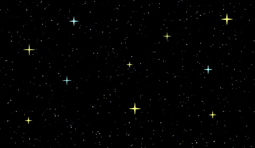

# 🌟 Starlight


*“Paint the night sky with code. Create stunning, interactive starry visualizations in your browser.”*

[](LICENSE)
[](https://github.com/rango527/coderduel-readme-challenge/tree/main/starlight)
[](https://github.com/rango527/coderduel-readme-challenge/issues)
[](https://github.com/rango527/coderduel-readme-challenge/pulls)
[]()
[]()

## 📋 Table of Contents

- [✨ Features](#-features)
- [🚀 Getting Started](#-getting-started)
- [📖 Usage Examples](#-usage-examples)
- [🔧 API Reference](#-api-reference)
- [🌐 Browser Support](#-browser-support)
- [🤝 Contributing](#-contributing)
- [🗺️ Roadmap](#️-roadmap)
- [📄 License](#-license)
- [🙏 Acknowledgments](#-acknowledgments)
- [📞 Contact](#-contact)

**Starlight** is an open-source JavaScript library that lets you craft breathtaking, interactive night sky visualizations. Whether you’re building an educational app, a creative portfolio piece, or just want to stargaze from your desk, Starlight makes it easy to render constellations, planets, and twinkling stars with minimal code. 🌌

Imagine turning your website into a portal to the cosmos—drag constellations, watch stars twinkle, and explore the universe right from your browser. Perfect for developers, educators, and dreamers alike!

## ✨ Features

- **Interactive Visuals**: Drag, zoom, and explore a dynamic starry sky. 🌠
- **Customizable**: Tweak star density, colors, constellations, and animations. 🎨
- **Lightweight**: Under 10KB minified, with zero dependencies. ⚡
- **Cross-Platform**: Works in any modern browser (Chrome, Firefox, Safari, Edge). 🌐
- **Developer-Friendly**: Simple API for quick integration into any web project. 🛠️
- **Accessible**: Keyboard-navigable and screen-reader compatible. ♿
- **Performance Optimized**: Smooth 60fps animations even with thousands of stars. 🚀
- **Extensible**: Add custom constellations, planets, or even shooting stars. 🌟

## 🎮 Demo

Check out a live demo of Starlight in action: [Live Demo](docs/index.html)

## 📸 Screenshots



*Watch Starlight in action: an interactive night sky with draggable constellations and glowing stars!*

## 🚀 Getting Started

Get Starlight up and running in **3 minutes**! No rocket science required—just a bit of code and a lot of wonder. 🔭

### Prerequisites

- A modern web browser (ES6+ support recommended)
- Basic HTML/CSS/JavaScript knowledge
- A sense of cosmic wonder 🌌

### Installation

1. **Download the source** (for manual integration):
   - Clone or download the repository.
   - Include `starlight/index.jsx` in your project.

2. **Or use a CDN** (for quick prototyping):
   ```html
   <script src="https://cdn.jsdelivr.net/gh/rango527/coderduel-readme-challenge/starlight/index.jsx"></script>
   ```

3. **Add a canvas to your HTML**:
   ```html
   <canvas id="starlight-canvas" width="800" height="600"></canvas>
   ```

4. **Initialize Starlight**:
   ```javascript
   const sky = new Starlight({
     canvas: document.getElementById('starlight-canvas'),
     stars: 500,
     constellations: ['Orion', 'Ursa Major'],
     theme: 'midnight'
   });
   sky.render();
   ```

That’s it! You’re now gazing at a starry sky. ✨

## 📖 Usage Examples

Dive into the cosmos with these examples. Copy-paste and customize to your heart's content!

### Basic Sky

Create a simple night sky with 100 stars:
```javascript
const sky = new Starlight({
  canvas: document.getElementById('my-canvas'),
  stars: 100,
  theme: 'default'
});
sky.render();
```

### Advanced Customization

Add planets, custom colors, and animations:
```javascript
const sky = new Starlight({
  canvas: document.getElementById('my-canvas'),
  stars: 1000,
  constellations: ['Orion', 'Ursa Major', 'Cassiopeia'],
  planets: [{ name: 'Mars', color: '#CD5C5C', size: 5 }],
  theme: 'aurora', // Custom theme with northern lights effect
  animations: {
    twinkle: true,
    shootingStars: true
  }
});
sky.render();

// Add interactivity
sky.on('starClick', (star) => {
  console.log(`Clicked on ${star.name}!`);
});
```

### Integrating with Frameworks

**React Example**:
```jsx
import React, { useEffect, useRef } from 'react';
import Starlight from 'starlight';

const StarryComponent = () => {
  const canvasRef = useRef(null);

  useEffect(() => {
    const sky = new Starlight({
      canvas: canvasRef.current,
      stars: 200
    });
    sky.render();
  }, []);

  return <canvas ref={canvasRef} />;
};

export default StarryComponent;
```

**Vue Example**:
```vue
<template>
  <canvas ref="starlightCanvas"></canvas>
</template>

<script>
import Starlight from 'starlight';

export default {
  mounted() {
    const sky = new Starlight({
      canvas: this.$refs.starlightCanvas,
      stars: 300
    });
    sky.render();
  }
};
</script>
```

## 🔧 API Reference

### Constructor Options

| Option | Type | Default | Description |
|--------|------|---------|-------------|
| `canvas` | `HTMLCanvasElement` | Required | The canvas element to render on. |
| `stars` | `number` | `100` | Number of stars to generate. |
| `constellations` | `string[]` | `[]` | Array of constellation names to draw (e.g., ['Orion']). |
| `planets` | `Planet[]` | `[]` | Array of planet objects (e.g., [{ name: 'Mars', color: '#CD5C5C', size: 5, x: 100, y: 200 }]). |
| `theme` | `string` | `'default'` | Color theme ('default', 'midnight', 'aurora'). |
| `animations` | `object` | `{}` | Animation settings (e.g., { twinkle: true, shootingStars: true }). |

### Methods

- `render()`: Renders the sky on the canvas.
- `update(options)`: Updates the sky with new options.
- `destroy()`: Cleans up the instance and stops animations.

### Events

- `starClick`: Fired when a star is clicked. Payload: `{ star: StarObject }`
- `constellationHover`: Fired on constellation hover (implementation in progress).

For full API docs, visit: [API Documentation](docs/index.html)

## 🌐 Browser Support

Starlight works in all modern browsers that support HTML5 Canvas and ES6+ features:

- Chrome 60+
- Firefox 55+
- Safari 12+
- Edge 79+

## 🤝 Contributing

We love cosmic contributions! 🌌 Whether it's fixing a bug, adding a feature, or improving docs, your help makes Starlight shine brighter.

### How to Contribute

1. **Fork** the repo on GitHub.
2. **Clone** your fork: `git clone https://github.com/rango527/coderduel-readme-challenge.git`
3. **Create a branch**: `git checkout -b feature/amazing-new-feature`
4. **Make changes** and test thoroughly.
5. **Commit**: `git commit -m "Add amazing new feature"`
6. **Push**: `git push origin feature/amazing-new-feature`
7. **Open a Pull Request**!

### Development Setup

1. Clone the repository: `git clone https://github.com/rango527/coderduel-readme-challenge.git`
2. Navigate to the project: `cd starlight`
3. Open `starlight/index.jsx` in your editor and make changes.
4. Test by opening `docs/index.html` in a browser.

### Guidelines

- Follow the existing code style (use consistent indentation and naming).
- Add comments for new features.
- Update documentation for API changes.
- Test in multiple browsers.
- Be kind and respectful in discussions.

## 🗺️ Roadmap

- [ ] Add more constellation data and accurate star positions.
- [ ] Implement full constellation hover and drag interactions.
- [ ] Support for custom star maps and astronomical data.
- [ ] Add sound effects for immersive experiences.
- [ ] Optimize for mobile devices and touch interactions.
- [ ] Create a React/Vue wrapper library.

## 📄 License

This project is licensed under the MIT License - see the [LICENSE](LICENSE) file for details.

## 🙏 Acknowledgments

- Inspired by the beauty of the night sky and the power of open-source.
- Thank you to all the contributors and astronomers who made this project so wonderful! ⭐
- Special thanks to the [Celestial Bodies Datasets](https://data.nasa.gov/) for providing constellation data.

## 📞 Contact

Got questions? Ideas? Or just want to chat about the starlight?

- **Email**: [ncao9127@gmail.com](mailto:ncao9127@gmail.com)
- **Phone**: <a href="tel:+13345830692">(334) 583-0692</a>
- **Github**: [@rango527](https://github.com/rango527)

---

*Made with ❤️ and a dash of stardust. If this README made you smile, give it a star! 🌟*
